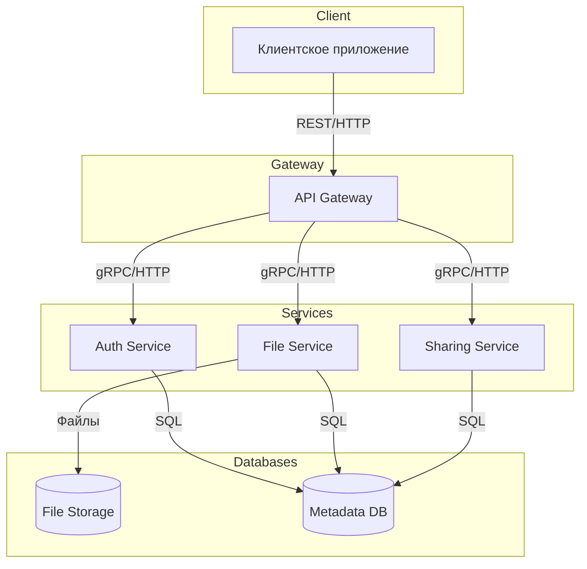
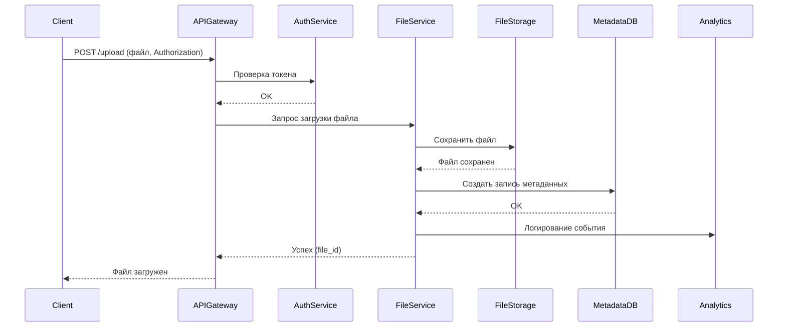
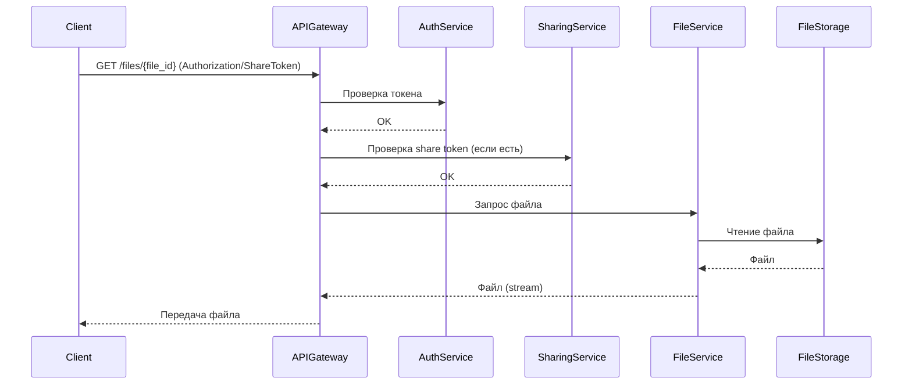
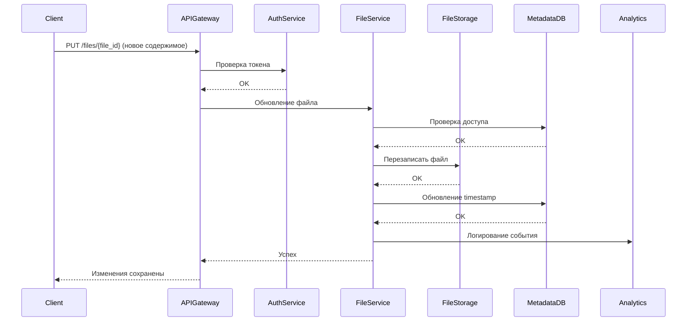
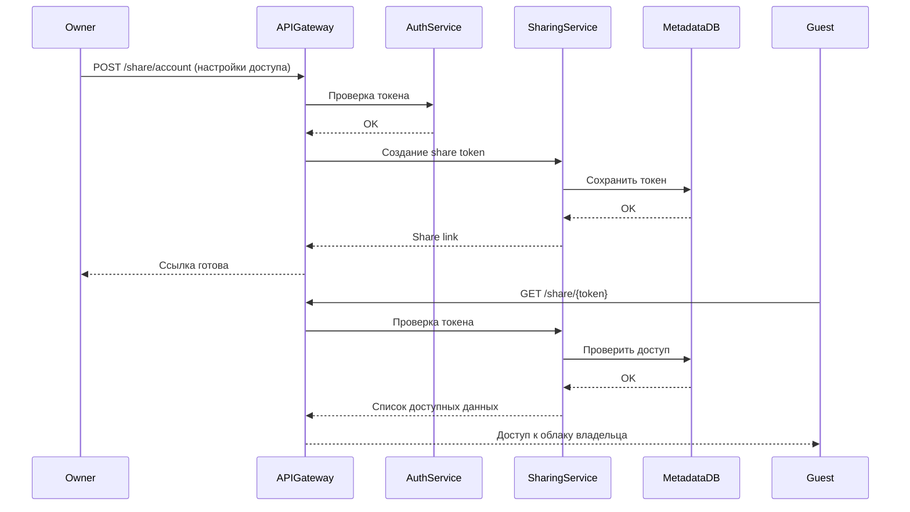

# Техническое решение проекта «Облачное файловое хранилище»

## Введение
- **Цель проекта:**  
  Создать облачное хранилище, поддерживающее хранение файлов разных форматов, дающее возможность делиться ими между разными пользователями  

- **Основания для разработки:**  
  Учебный проект по курсу «Основы распределенных вычислений»

- **Команда:**  
  Лосев Иван - тимлид, разработчик
  Киселева Софья Владимировна - разработчик

---

## Глоссарий
| Термин        | Определение |
|---------------|-------------|
| **Облачное хранилище**  | модель онлайн-хранилища, данные в котором хранятся на множественных серверах, распределённых в сети |
| **Пользователь** | субъект, зарегистрированный в системе |
| **Файл** | единица данных, загруженная в систему, имеет метаданные (имя, размер, тип, владелец) |
| **Владелец** | пользователь, загрузивший файл. Имеет полные права (изменение, удаление) |
| **ACL** | список разрешений на действия с объектами и бакетами |

---

## Функциональные требования
Система должна предоставлять следующие функции:
1. Загрузка файлов
2. Скачивание
3. Передача файлов между клиентами

---

## Нефункциональные требования
- **Масштабируемость:** возможность увеличения числа узлов без модификации логики. 
- **Производительность:** поддержка параллельных загрузок/загрузок больших файлов.
- **Безопасность:** пароли хранятся в виде хешей; доступ к приватным файлам только для владельца или назначенных пользователей; публичные ссылки — случайные строки.
- **Поддерживаемость:** ясная структура кода, комментарии, простые адаптируемые интерфейсы.
- **Тестируемость:** модульные тесты для основных функций + интеграционные тесты.

---

## Пользовательские сценарии
### Сценарий: регистрация нового пользователя
1. Пользователь нажимает кнопку "регистрация".
2. Пользователь вводит личные данные (логин, пароль).
3. Происходит проверка, существует ли такой пользователь, если нет, то создается аккаунт.
4. Пользователь попадает в личный кабинет, получает доступ к интерфейсу.

### Сценарий: загрузка файла
1. Пользователь выбирает загрузку файла.
2. На экране пользователя появляется окно выбора с возможностью "перетащить файл", "загрузить файл с диска"
3. Пользователь выбирает способ загрузки файла, загружает файл.
4. Нажимает кнопку "отправить".
5. Файл сохраняется в системе.

### Сценарий: выгрузка файла
1. Пользователь находит необходимый файл в личном облаке\облаке, к которому имеет доступ.
2. Пользователь нажимает кнопку "скачать файл".
3. На экране пользователя появляется окно выбора диска для загрузки нового файла.
4. Пользователь выбирает место выгрузки файла, нажимает кнопку "скачать".
5. Файл скачивается на диске у пользователя.

### Сценарий: редактирование документа в облаке
1. Пользователь открывает файл в личном облаке.
2. Просто просматривает его, либо редактирует.
3. Все изменения автоматически сохраняются в системе

### Сценарий: предоставление владельцем облака доступа другому пользователю
1. Владелец облака А копирует ссылку на свое облако из личного кабинета, делится ей с другими пользователями.
2. Пользователь открывает ссылку, регистрируется при необходимости, получает доступ к облаку А.

### Сценарий: передача данных между пользователем A и пользователем B
1. Пользователь А выбирает личный файл, который хочет поделиться.
2. Появляется окно, Пользователь А нажимает кнопку "Поделиться", выбирает "поделиться файлом", отправляет его пользователю В.
3. Пользователь В получает файл и скачивает его, по желанию.

### Сценарий: передача доступа к данным между пользователем A и пользователем B
1. Пользователь А выбирает личный файл, к которому хочет передать доступ.
2. Появляется окно, Пользователь А нажимает кнопку "Поделиться", выбирает "поделиться доступом", создается ссылка, которую отправляет пользователю В.
3. Пользователь В переходит по ссылке в документ в облаке пользователя А, получает доступ к его прочтению и изменению. Все изменения сохраняются в облаке

---

##  Архитектура системы

**Основные компоненты:**

***API Gateway / HTTP API*** — входная точка в систему. Обрабатывает все HTTP-запросы от клиентов, маршрутизирует их к соответствующим сервисам/обработчикам, проверяет аутентификацию и права доступа.

***Auth Service*** — сервис аутентификации и управления сессиями. Отвечает за регистрацию пользователей, вход в систему.

***File Service*** — основной сервис для работы с файлами. Обеспечивает загрузку, скачивание, удаление, обновление метаданных и управление ACL.

***Sharing Service*** — сервис управления публичными и приватными ссылками. Отвечает за создание и предоставление доступа к файлам по ссылке.

***File Storage / FS*** — физическое хранилище файлов (локальная файловая система или объектное хранилище). File Service взаимодействует с ним для сохранения и чтения файлов.

***Metadata DB*** — база данных для хранения информации о пользователях, файлах, ACL, сессиях и share-токенах (например, BoltDB, SQLite или PostgreSQL).

**Взаимодействие компонентов:**

Клиент → API Gateway → Auth Service (для аутентификации).

Клиент → API Gateway → File Service → File Storage / Metadata DB (для операций с файлами).

File Service → Sharing Service → Metadata DB (для создания и проверки share-токенов).



---

## Технические сценарии
### Сценарий: загрузка файла
1. Клиент отправляет в API Gateway запрос POST /upload с файлом и токеном сессии в заголовке Authorization.
2. API Gateway проверяет токен через Auth Service.
3. После успешной аутентификации API Gateway перенаправляет запрос в File Service.
4. File Service сохраняет файл во временное хранилище, затем перемещает его в основное File Storage.
5. File Service создает запись метаданных в Metadata DB.
6. File Service отправляет событие в Logging/Analytics Service (опционально).
7. File Service возвращает API Gateway подтверждение успешной загрузки с file_id.
8. API Gateway возвращает ответ клиенту.



### Сценарий: скачивание файла:
1. Клиент отправляет в API Gateway запрос GET /files/{file_id} с токеном в заголовке Authorization или публичным share token.
2. API Gateway проверяет токен через Auth Service или share token через Sharing Service.
3. После успешной проверки API Gateway перенаправляет запрос в File Service.
4. File Service проверяет права доступа пользователя к файлу (ACL).
5. File Service считывает файл из File Storage.
6. File Service возвращает поток файла в API Gateway.
7. API Gateway передает файл клиенту.



### Сценарий: создание публичной ссылки (share link)
1. Клиент отправляет в API Gateway запрос POST /files/{file_id}/share с параметрами public и expires_seconds.
2. API Gateway проверяет токен через Auth Service.
3. API Gateway перенаправляет запрос в Sharing Service.
4. Sharing Service проверяет права пользователя на файл через File Service/Metadata DB.
5. Sharing Service генерирует уникальный share token и сохраняет его в Metadata DB.
6. Sharing Service возвращает API Gateway ссылку для доступа к файлу.
7. API Gateway возвращает ссылку клиенту.

```mermaid
sequenceDiagram
  participant Client
  participant APIGateway
  participant AuthService
  participant SharingService
  participant MetadataDB
  participant FileService

  Client->>APIGateway: POST /files/{file_id}/share (public, expires)
  APIGateway->>AuthService: Проверка токена
  AuthService-->>APIGateway: OK
  APIGateway->>SharingService: Создание share token
  SharingService->>FileService: Проверка прав доступа
  FileService->>MetadataDB: Проверка ACL
  MetadataDB-->>FileService: OK
  SharingService->>MetadataDB: Сохранение share token
  MetadataDB-->>SharingService: OK
  SharingService-->>APIGateway: Share link
  APIGateway-->>Client: Share link
  ```

### Сценарий: передача файла другому пользователю (transfer):
1. Клиент отправляет в API Gateway запрос POST /files/{file_id}/transfer с параметром to_username.
2. API Gateway проверяет токен через Auth Service.
3. API Gateway перенаправляет запрос в File Service.
4. File Service проверяет, что пользователь — владелец файла.
5. File Service обновляет ACL или меняет владельца файла в Metadata DB.
6. File Service логирует операцию в Analytics/Logging Service.
7. File Service возвращает API Gateway подтверждение успешной передачи.
8. API Gateway возвращает ответ клиенту.

```mermaid
sequenceDiagram
  participant Client
  participant APIGateway
  participant AuthService
  participant FileService
  participant MetadataDB
  participant Analytics

  Client->>APIGateway: POST /files/{file_id}/transfer (to_username)
  APIGateway->>AuthService: Проверка токена
  AuthService-->>APIGateway: OK
  APIGateway->>FileService: Передача файла
  FileService->>MetadataDB: Проверка владельца и обновление ACL
  MetadataDB-->>FileService: OK
  FileService->>Analytics: Логирование события
  FileService-->>APIGateway: Успех
  APIGateway-->>Client: Файл передан
  ```

### Сценарий: регистрация нового пользователя
1. Клиент отправляет в API Gateway запрос POST /auth/register с личными данными (логин, пароль, e-mail).
2. API Gateway перенаправляет запрос в Auth Service.
3. Auth Service проверяет, что логин не занят, и хэширует пароль.
4. Auth Service создает новую запись пользователя в Metadata DB.
5. Auth Service создает токен сессии (access token).
6. Auth Service возвращает токен в API Gateway.
7. API Gateway возвращает успешный ответ клиенту с токеном и данными пользователя.

```mermaid
sequenceDiagram
  participant Client
  participant APIGateway
  participant AuthService
  participant MetadataDB

  Client->>APIGateway: POST /auth/register (логин, пароль, email)
  APIGateway->>AuthService: Запрос регистрации
  AuthService->>MetadataDB: Проверка уникальности логина
  MetadataDB-->>AuthService: OK
  AuthService->>MetadataDB: Создание пользователя
  MetadataDB-->>AuthService: OK
  AuthService-->>APIGateway: Токен сессии
  APIGateway-->>Client: Регистрация успешна
```

### Сценарий: редактирование документа в облаке
1. Клиент открывает документ и начинает его редактировать.
2. Клиент через API Gateway периодически отправляет PUT /files/{file_id} с обновлённым содержимым файла (или патчем).
3. API Gateway проверяет токен через Auth Service.
4. API Gateway перенаправляет запрос в File Service.
5. File Service проверяет права доступа к файлу через Metadata DB.
6. File Service обновляет содержимое файла в File Storage.
7. File Service обновляет timestamp версии файла в Metadata DB.
8. File Service отправляет сообщение в Analytics/Logging Service об изменении файла.
9. File Service возвращает API Gateway подтверждение.
10. API Gateway уведомляет клиента об успешном сохранении изменений.



### Сценарий: предоставление владельцем облака доступа другому пользователю (через ссылку на облако)
1. Клиент (владелец) отправляет в API Gateway запрос POST /share/account или POST /share/folder/{id} с параметрами доступа.
2. API Gateway проверяет токен через Auth Service.
3. API Gateway перенаправляет запрос в Sharing Service.
4. Sharing Service создает share token на весь аккаунт или выбранный каталог и сохраняет его в Metadata DB.
5. Sharing Service возвращает API Gateway ссылку.
6. API Gateway возвращает ссылку клиенту.
7. Другой пользователь открывает ссылку — отправляет запрос в API Gateway GET /share/{token}.
8. API Gateway проверяет share token в Sharing Service.
9. Sharing Service возвращает список доступных файлов и разрешения.
10. API Gateway возвращает данные клиенту, который получает доступ к облаку владельца.



---

## План разработки и тестирования
### Этап 1 — Базовая инфраструктура
Проектирование архитектуры (API Gateway, Auth, File Storage, Collaboration, Analytics, Notifications), Настройка окружения и CI/CD, Подготовка схем БД.

### Этап 2 — Пользователи и доступ
Реализация сервиса Auth: регистрация, аутентификация, управление сессиями и токенами
Интеграция Auth с API Gateway
Настройка ролей и прав доступа

### Этап 3 — Файловое хранилище
Реализация сервиса FileStorage: загрузка файла, выгрузка файла, хранение метаданных (владелец, права доступа, история изменений)
Интеграция с API Gateway

### Этап 4 — Совместная работа и редактирование

Реализация сервиса Collaboration: открытие файла в режиме редактирования, автоматическое сохранение изменений
Интеграция Collaboration с FileStorage
