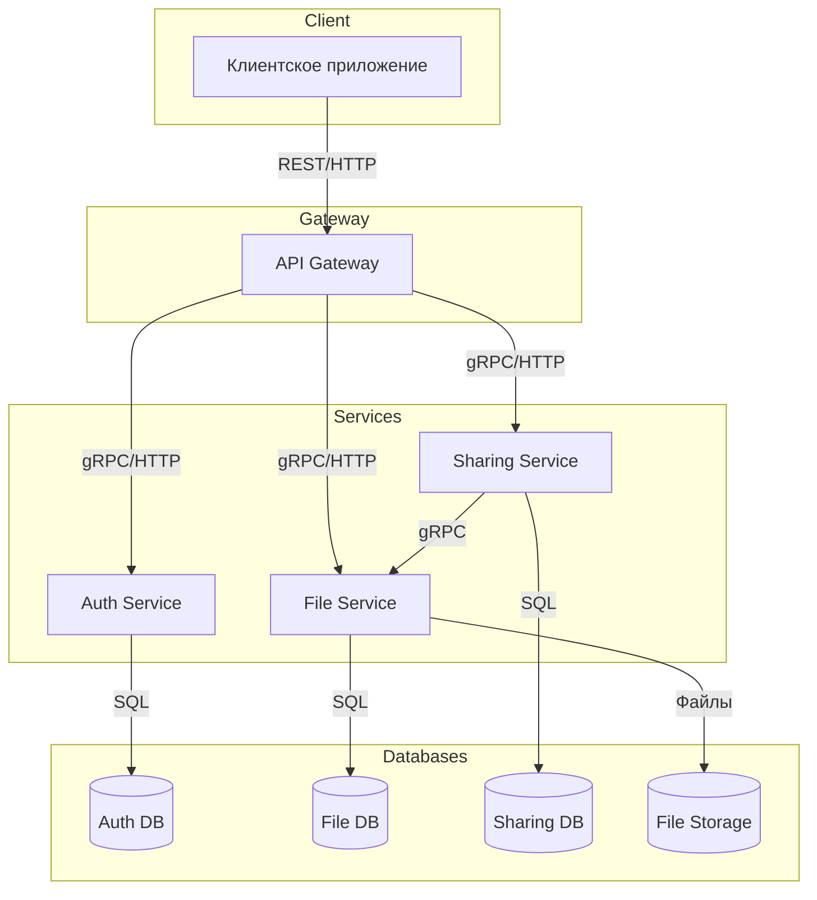
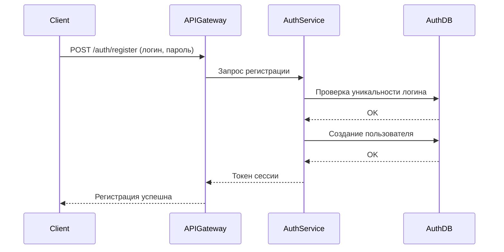
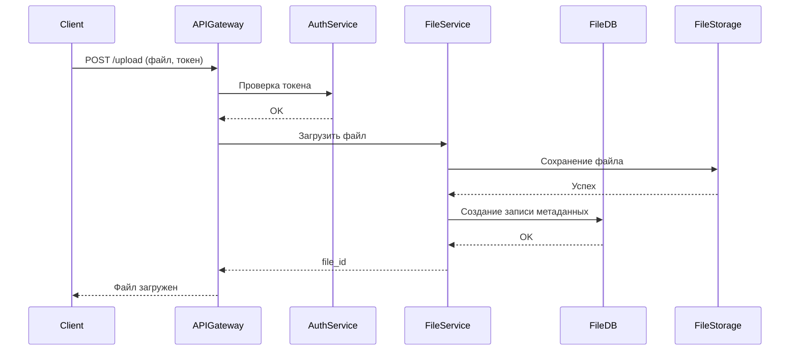
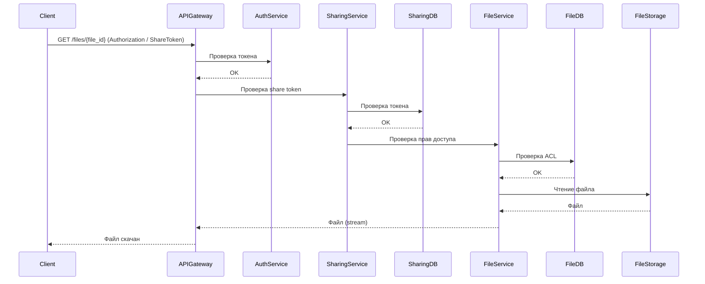

# Техническое решение проекта «Облачное файловое хранилище»

## Введение
- **Цель проекта:**  
  Создать облачное хранилище, поддерживающее хранение файлов разных форматов, дающее возможность делиться ими между разными пользователями  

- **Основания для разработки:**  
  Учебный проект по курсу «Основы распределенных вычислений»

- **Команда:**  
  Лосев Иван - тимлид, разработчик
  Киселева Софья Владимировна - разработчик

---

## Глоссарий
| Термин        | Определение |
|---------------|-------------|
| **Облачное хранилище**  | модель онлайн-хранилища, данные в котором хранятся на множественных серверах, распределённых в сети |
| **Пользователь** | субъект, зарегистрированный в системе |
| **Файл** | единица данных, загруженная в систему, имеет метаданные (имя, размер, тип, владелец) |
| **Владелец** | пользователь, загрузивший файл. Имеет полные права (изменение, удаление) |
| **ACL** | список разрешений на действия с объектами и бакетами |

---

## Функциональные требования
Система должна предоставлять следующие функции:
1. Загрузка файлов
2. Скачивание
3. Передача файлов между клиентами

---

## Нефункциональные требования
- **Масштабируемость:** возможность увеличения числа узлов без модификации логики. 
- **Производительность:** поддержка параллельных загрузок/загрузок больших файлов.
- **Безопасность:** пароли хранятся в виде хешей; доступ к приватным файлам только для владельца или назначенных пользователей; публичные ссылки — случайные строки.
- **Поддерживаемость:** ясная структура кода, комментарии, простые адаптируемые интерфейсы.
- **Тестируемость:** модульные тесты для основных функций + интеграционные тесты.

---

## Пользовательские сценарии
### Сценарий: регистрация нового пользователя
1. Пользователь нажимает кнопку "регистрация".
2. Пользователь вводит личные данные (логин, пароль).
3. Происходит проверка, существует ли такой пользователь, если нет, то создается аккаунт. Если под введенными данными уже существует пользователь - выведется ошибка, пользователю предложится ввсети данные снова. 
4. Пользователь попадает в личный кабинет, получает доступ к интерфейсу.

### Сценарий: загрузка файла
1. Пользователь выбирает загрузку файла.
2. На экране пользователя появляется окно выбора с возможностью "перетащить файл", "загрузить файл с диска"
3. Пользователь выбирает способ загрузки файла, загружает файл.
4. Нажимает кнопку "отправить".
5. Файл сохраняется в системе.

### Сценарий: скачивание файла
1. Пользователь находит необходимый файл в личном облаке\облаке, к которому имеет доступ.
2. Пользователь нажимает кнопку "скачать файл".
3. На экране пользователя появляется окно выбора диска для загрузки нового файла.
4. Пользователь выбирает место выгрузки файла, нажимает кнопку "скачать".
5. Файл скачивается на диске у пользователя.

### Сценарий: предоставление владельцем облака доступа другому пользователю
1. Владелец облака А копирует ссылку на свое облако из личного кабинета, делится ей с другими пользователями.
2. Пользователь открывает ссылку, регистрируется при необходимости, получает доступ к облаку А.

### Сценарий: передача данных между пользователем A и пользователем B
1. Пользователь А выбирает личный файл, который хочет поделиться.
2. Появляется окно, Пользователь А нажимает кнопку "Поделиться", выбирает "поделиться файлом", отправляет его пользователю В.
3. Пользователь В получает файл и скачивает его, по желанию.

### Сценарий: передача доступа к данным между пользователем A и пользователем B
1. Пользователь А выбирает личный файл, к которому хочет передать доступ.
2. Появляется окно, Пользователь А нажимает кнопку "Поделиться", выбирает "поделиться доступом", создается ссылка, которую отправляет пользователю В.
3. Пользователь В переходит по ссылке в документ в облаке пользователя А, получает доступ к его прочтению и изменению. Все изменения сохраняются в облаке

---

##  Архитектура системы

**Основные компоненты:**

***API Gateway / HTTP API*** — входная точка в систему. Обрабатывает все HTTP-запросы от клиентов, маршрутизирует их к соответствующим сервисам/обработчикам, проверяет аутентификацию и права доступа.

***Auth Service*** — сервис аутентификации и управления сессиями. Отвечает за регистрацию пользователей, вход в систему.

***File Service*** — основной сервис для работы с файлами. Обеспечивает загрузку, скачивание, удаление, обновление метаданных и управление ACL.

***Sharing Service*** — сервис управления публичными и приватными ссылками. Отвечает за создание и предоставление доступа к файлам по ссылке.

***File Storage / FS*** — физическое хранилище файлов (локальная файловая система или объектное хранилище). File Service взаимодействует с ним для сохранения и чтения файлов.

***Auth DB*** — пользователи, хэши паролей, токены;

***File DB***— метаданные файлов, владельцы, ACL;

***Sharing DB*** — токены доступа и их связь с файлами.

**Взаимодействие компонентов:**

Клиент → API Gateway → Auth Service (для аутентификации).

Клиент → API Gateway → File Service → File Storage / Metadata DB (для операций с файлами).

File Service → Sharing Service → Metadata DB (для создания и проверки share-токенов).



---

## Технические сценарии
### Сценарий: регистрация нового пользователя
1. Клиент отправляет запрос POST /auth/register с логином и паролем.
2. API Gateway перенаправляет запрос в Auth Service.
3. Auth Service проверяет уникальность логина в Auth DB.
4. Если логин свободен — хэширует пароль и сохраняет пользователя в Auth DB.
5. Генерируется токен доступа.
6. Auth Service возвращает токен в API Gateway.
7. API Gateway возвращает успешный ответ клиенту.



### Сценарий: загрузка файла
1. Клиент отправляет в API Gateway запрос POST /upload с файлом и токеном.
2. API Gateway проверяет токен через Auth Service.
3. После проверки API Gateway перенаправляет запрос в File Service.
4. File Service сохраняет файл в File Storage.
5. File Service сохраняет метаданные (имя, размер, владелец, ACL) в File DB.
6. File Service уведомляет Analytics Service (опционально).
7. Возвращается file_id клиенту.



### Сценарий: скачивание файла:
1. Клиент делает запрос GET /files/{file_id} (с токеном или share token).
2. API Gateway проверяет токен через Auth Service, либо передаёт share token в Sharing Service.
3. Sharing Service ищет токен в Sharing DB.
4. Если токен валиден, Sharing Service запрашивает права доступа у File Service (через API).
5. File Service проверяет ACL в File DB.
6. Если разрешено, File Service получает файл из File Storage и возвращает его.



### Сценарий: создание публичной ссылки (share link)
1. Клиент вызывает POST /files/{id}/share.
2. API Gateway проверяет токен через Auth Service.
3. API Gateway передаёт запрос в Sharing Service.
4. Sharing Service вызывает File Service, чтобы проверить, есть ли у пользователя право поделиться файлом.
5. File Service проверяет права в File DB и возвращает результат.
6. Если доступ разрешён, Sharing Service создаёт share token и сохраняет его в Sharing DB.
7. Sharing Service возвращает ссылку клиенту.

```mermaid
sequenceDiagram
  participant Client
  participant APIGateway
  participant AuthService
  participant SharingService
  participant SharingDB
  participant FileService
  participant FileDB

  Client->>APIGateway: POST /files/{id}/share
  APIGateway->>AuthService: Проверка токена
  AuthService-->>APIGateway: OK
  APIGateway->>SharingService: Запрос создания share link
  SharingService->>FileService: Проверка прав на файл
  FileService->>FileDB: Проверка ACL
  FileDB-->>FileService: OK
  FileService-->>SharingService: Доступ разрешён
  SharingService->>SharingDB: Сохранение share token
  SharingDB-->>SharingService: OK
  SharingService-->>APIGateway: share link
  APIGateway-->>Client: ссылка создана
  ```

### Сценарий: передача файла другому пользователю (transfer):
1. Клиент отправляет POST /files/{id}/transfer (to_username).
2. API Gateway проверяет токен через Auth Service.
3. API Gateway перенаправляет запрос в File Service.
4. File Service проверяет владельца в File DB.
5. Обновляет ACL или владельца в File DB.
6. (Опционально) File Service уведомляет Analytics Service.
7. Возвращает подтверждение клиенту.

```mermaid
sequenceDiagram
  participant Client
  participant APIGateway
  participant AuthService
  participant FileService
  participant MetadataDB
  participant Analytics

  Client->>APIGateway: POST /files/{file_id}/transfer (to_username)
  APIGateway->>AuthService: Проверка токена
  AuthService-->>APIGateway: OK
  APIGateway->>FileService: Передача файла
  FileService->>MetadataDB: Проверка владельца и обновление ACL
  MetadataDB-->>FileService: OK
  FileService->>Analytics: Логирование события
  FileService-->>APIGateway: Успех
  APIGateway-->>Client: Файл передан
  ```

### Сценарий: предоставление владельцем облака доступа другому пользователю (через ссылку на облако)
1. Владелец отправляет POST /share/folder/{id}.
2. API Gateway проверяет токен в Auth Service.
3. Sharing Service создаёт токен и сохраняет в Sharing DB.
4. Другой пользователь открывает ссылку → API Gateway → Sharing Service.
5. Sharing Service проверяет токен в Sharing DB и обращается к File Service для получения списка доступных файлов.
6. File Service достаёт данные из File DB и возвращает их.
7. Sharing Service возвращает результат клиенту.

```mermaid
sequenceDiagram
  participant Owner
  participant APIGateway
  participant AuthService
  participant SharingService
  participant MetadataDB
  participant Guest

  Owner->>APIGateway: POST /share/account (настройки доступа)
  APIGateway->>AuthService: Проверка токена
  AuthService-->>APIGateway: OK
  APIGateway->>SharingService: Создание share token
  SharingService->>MetadataDB: Сохранить токен
  MetadataDB-->>SharingService: OK
  SharingService-->>APIGateway: Share link
  APIGateway-->>Owner: Ссылка готова

  Guest->>APIGateway: GET /share/{token}
  APIGateway->>SharingService: Проверка токена
  SharingService->>MetadataDB: Проверить доступ
  MetadataDB-->>SharingService: OK
  SharingService-->>APIGateway: Список доступных данных
  APIGateway-->>Guest: Доступ к облаку владельца
```

---

## План разработки и тестирования
### Основной проект(MVP)
#### Этап 1 — Базовая инфраструктура
Проектирование архитектуры (API Gateway, Auth, File Storage, Collaboration, Analytics, Notifications), Настройка окружения и CI/CD, Подготовка схем БД.

#### Этап 2 — Пользователи и доступ
Реализация сервиса Auth: регистрация, аутентификация, управление сессиями и токенами
Интеграция Auth с API Gateway
Настройка ролей и прав доступа

#### Этап 3 — Файловое хранилище
Реализация сервиса FileStorage: загрузка файла, выгрузка файла, хранение метаданных (владелец, права доступа, история изменений)
Интеграция с API Gateway

#### Тестирование:
- Модульные и интеграционные тесты
- Проверка прав доступа и граничных случаев

#### DoD:
- Работают регистрация, вход, загрузка и скачивание файлов
- Все компоненты покрыты тестами

### Расширенный проект
#### Этап 4 — Совместная работа и редактирование
Реализация сервиса Collaboration: открытие файла в режиме редактирования, автоматическое сохранение изменений
Интеграция Collaboration с FileStorage

#### Тестирование:
- Тесты на совместную работу
- Нагрузочные тесты
- Тесты на отказоустойчиваость

#### Dod:
- Все функции работают:
  • регистрация нового пользователя
  • загрузка файла
  • скачивание файла
  • предоставление владельцем облака доступа другому пользователю
  • передача данных между пользователем A и пользователем B
  • передача доступа к данным между пользователем A и пользователем B
- Есть front
- Проект проходит проверки
- Проект одобрен преподавателями
